# Swiftsparrow

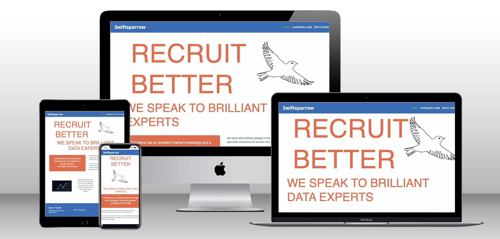

## Table of Contents

1. User Experience
    1. Purpose of the Website
    2. User Stories
    3. Wireframes
    4. Colour Palette 
    5. Fonts

2. Features

3. Testing
    1. Manual Testing
    2. Wave - Testing for Accessibility
    3. Lighthouse - Testing for Performance and Accessibility
    4. HTML Validator
    5. CSS Validator

4. Credits

5. Image Credits

6. Technologies Used

7. Deployment Information
    1. Version Control
    2. Deployment to Github Pages
    3. Clone the Repository Code Locally

 ## 1. User Experience

 ### 1.1 Purpose of the Website

 Swiftsparrow is a website for a recruitment business. I want people to be able to use the site to understand what we do and how to get in touch with us. The style should be simple to use and navigate, professional and friendly.

 The website is built using HTML 5, CSS3 and the Bootstrap library v5.3.

 ### 1.2 User Stories
 
 #### User Story 1 
 
 A candidate is looking for a new role and they are looking for a reputable recruiter with industry knowledge and contacts
 
 ##### Tasks
 
 - Create an area with a quote from a client
 - Layout clearly the job types in the text in a visually noticeable way
 
 #### User Story 2 
 
 A Candidate who has been approached wants to get a feel for how the recruiter would be to work with and how to get in touch.
 
 ##### Tasks
 
 - Make a clear Contact section with all relevant details
 - Make sure website has correct semantic html and other accessiblity features.
 
 #### User Story 3  
 
 A Client wants to work with a reliable, professional recruiter.
 
 ##### Tasks
 
 - Ensure site looks professionally laid out and responsive on all screen sizes
 - Ensure a link to the data policy is included in the footer.


 ### 1.3 Wireframe Designs

 The wireframes were created using [Balsamiq](https://balsamiq.com/). The design of the site has evolved since doing these, but these are the initial wireframes.

 #### Home Page

 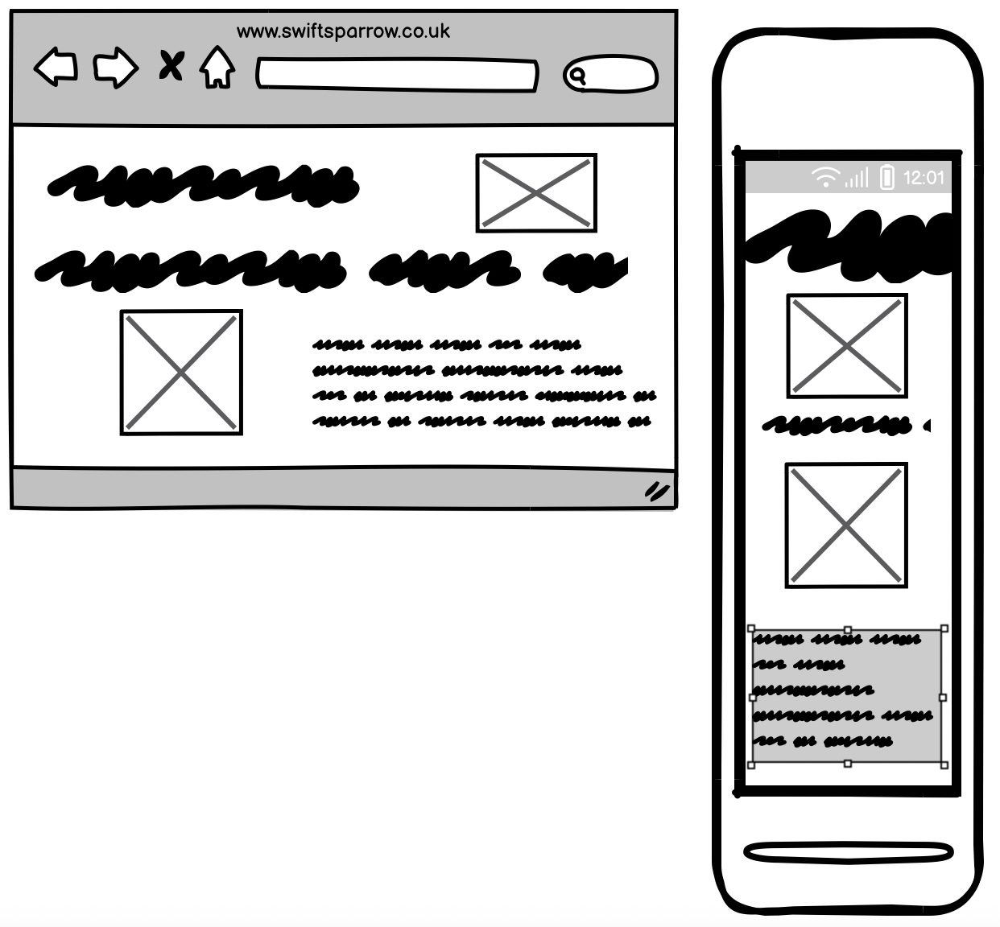

#### Looking for a Job Page


#### Contact Page

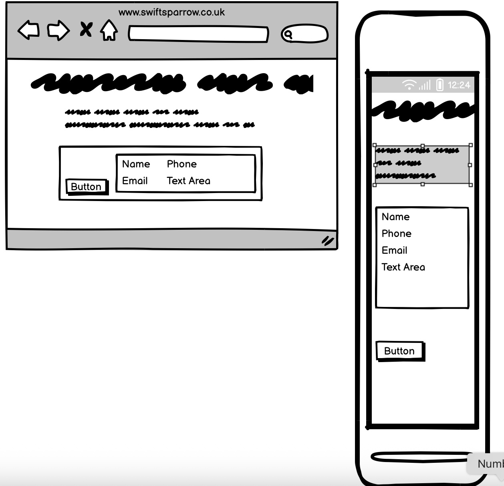

 ### Colour Palette used

The website uses a colour palette generated by [coloors.co](https://coolors.co/).

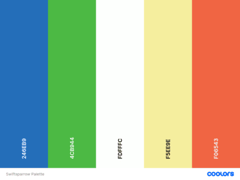

 The primary colour is #246EB9
 The secondary colour is #4CB944
 The highlight colour is #F5EE9E
 The background colour-light is #FDFFFC
 The background color-dark is #F06543

I also used 2 other colours. I used #FCD4C5, a lighter pink, as a hover colour in the navbar, this is my secondary colour in the CSS variables. Using this colour helped me avoid contrast errors. I used #36454f, a dark grey,  as a colour for my text. It gave a softer appearance than black.

The colours were designed to be bright and standout, but still 'friendly' and easy to use.


### 1.4 Fonts 

[Google Fonts](https://fonts.google.com/) were used. Open Sans is used for the majority of text. Montserrat is used for most of the headers. Raleway for some larger font sizes in headers. The back-up font is Sans-Serif.


## 2. Features

 The website should have the following features:
 
 - A home page with information about the company. This should include a recommendation quotes. It is built using Bootstrap grid system.
 - The purpose of this page is to give a user a visually appealing and simple introduction to the company.


 


 - A "Looking for a Job" page with clear information to help candidates understand the roles Swiftsparrow works on. This was built using Bootstrap grid system and cards for the job types.
 - The purpose of this feature is to allow users to get a greater depth of the work the company does 


 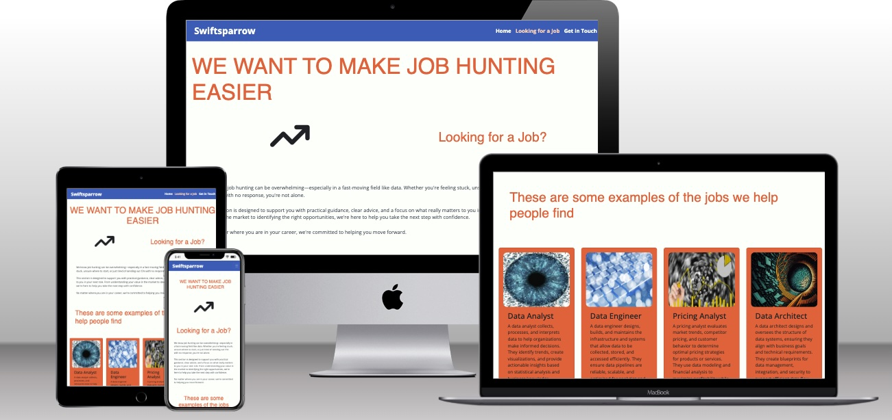


 - A "Contact Us" Page with a form that allows users to send information and their CV. The form was built using Bootstrap.
 - The purpose of this page is to allow people to contact the business and submit a CV if they want to.


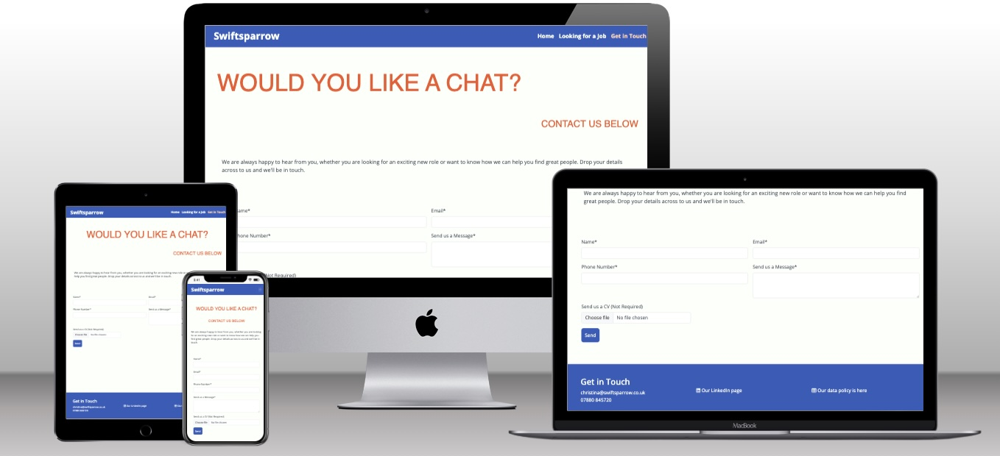


 - A "Thank you" page that appears when someone has submitted the form.
 - The purpose of this feature is so a user knows that they have successfully submitted the form


  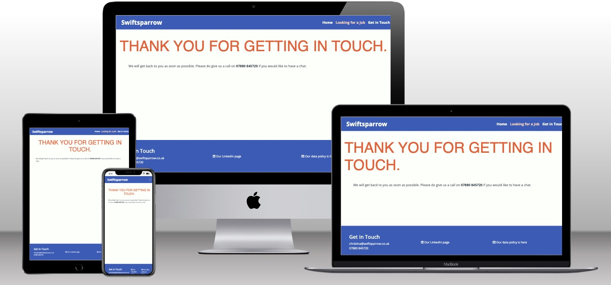


 - A "Data Policy" page that is mostly text and explains the company policy.
 - This is a legal requirement for a recruitment firm.


 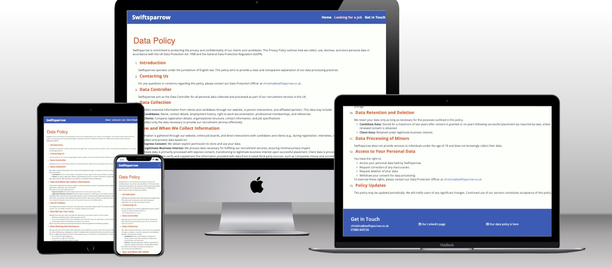


 - An error-404 page that appears when the server cannot access the specific page that a user has entered the url for. This page has a navbar to help guide the user back to the main site. 


  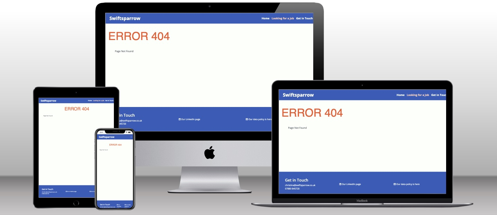


 - An easy to use navigation menu on all pages. This was built using Bootstrap and custom CSS.


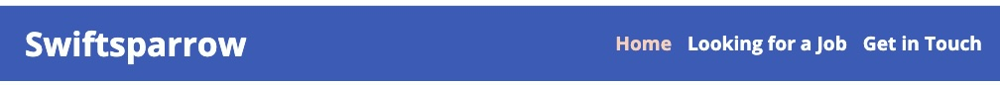


 - Visually pleasing footer on all pages with contact details and a link to the data policy. This was built using Bootstrap and Custom CSS.


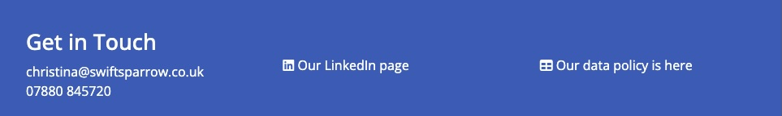


## 3. Testing

Testing was carried out to ensure that all aspects of the website worked and had the highest accessibility possible.

### 3.1 Manual Testing

All links have been manually tested across the website. The contact form was also manually tested to ensure the inputs were working correctly.

I did manual testing to test reponsiveness using Google Dev Tools, an iphone 14 and a Google Pixel 8.

I also tested manually to ensure the Error 404 page was working.


### 3.2 Wave - Testing for Accessibility

I used the [Wave](https://wave.webaim.org/extension/) Chrome extension tool to test contrast and other accessibility issues with the site. This was used throughout development to check - 

- All forms have associated labels or aria-labels so that this is read out on a screen reader to users who tab to form inputs
- Color contrasts meet a minimum ratio as specified in [WCAG 2.1 Contrast Guidelines](https://www.w3.org/WAI/WCAG21/Understanding/contrast-minimum.html)
- Heading levels are not missed or skipped to ensure the importance of content is relayed correctly to the end user
- All content is contained within landmarks to ensure ease of use for assistive technology, allowing the user to navigate by page regions
- All not textual content had alternative text or titles so descriptions are read out to screen readers
- HTML page lang attribute has been set
- Aria properties have been implemented correctly
- WCAG 2.1 Coding best practices being followed

I used it to test the Home page.

 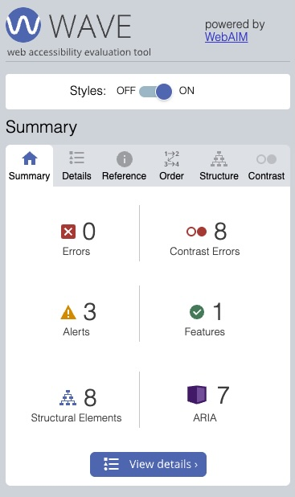

 It highlighted that the text in my footer and navbar were not sufficiently high contrast from the background - 

 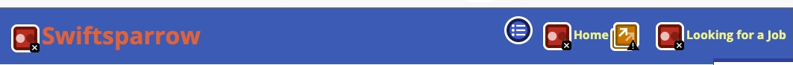

 To rectify this I adjusted the colours of the text and hover.


 It also highlighted that I had skipped a header level on my 'Get in Touch' page by using an h3 tag on my footer -

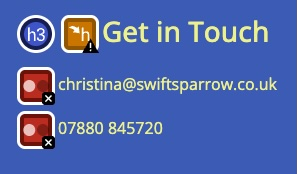

I rectified this by changing the footer in all the headers to h2 and adjusting the styling in my CSS file.

It also picked up that the link to the data policy in the page didn't have enough detail -

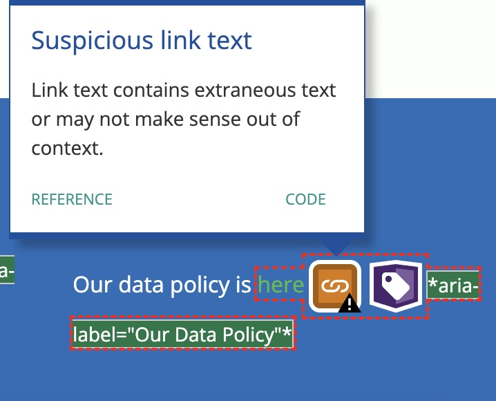

I corrected this on each page manually.

The Looking for a job page had a warning about 'redundant links'

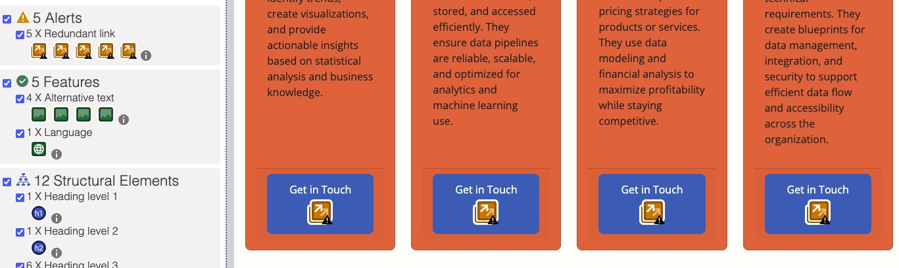

I chose not to change this as I wanted each of these links to lead to the contact form.

There were no other warnings/alerts on the site.

### 3.3 Lighthouse - Testing for Performance and Accessibility

I was aiming for 90% performance across the site using Lighthouse. 

The home page reached this standard -

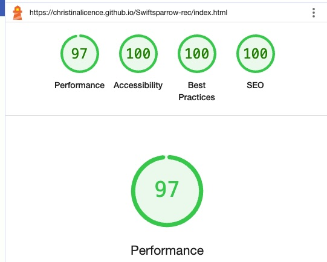

The Looking for a Job page performed well -

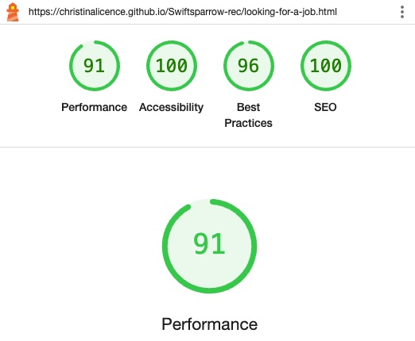

The Contact page performed well -

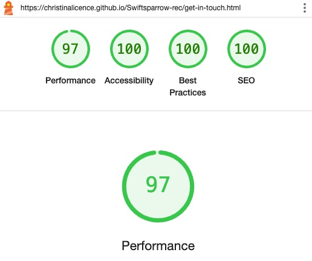

The Data Policy page performed well -

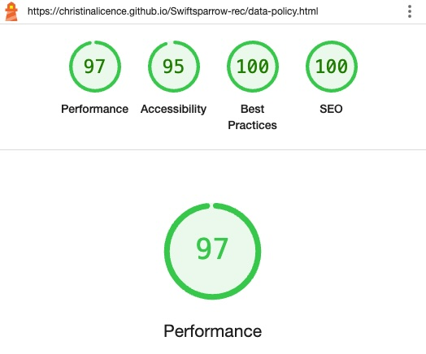

### 3.4 CSS Validator

I used [W3 CSS validator](https://jigsaw.w3.org/css-validator/)

It showed no errors -

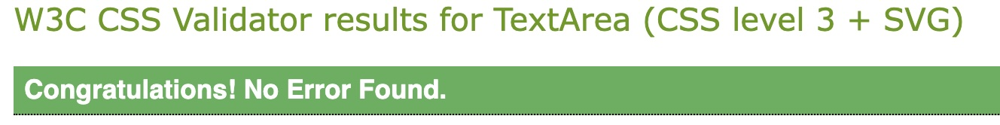


### 3.5 HTML Validator

I used [W3 HTML validator](https://validator.w3.org/)

For the home page I got some INFO warnings about trailing slashes on void elements. This was because of the VS Code extension I used for formatting the code. I corrected these manually.

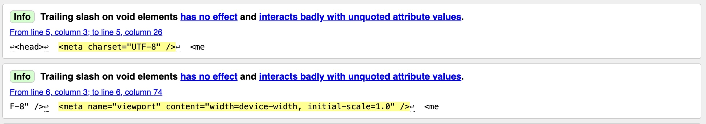

For the Looking for a Job page there were some HTML errors, I fixed these manually.

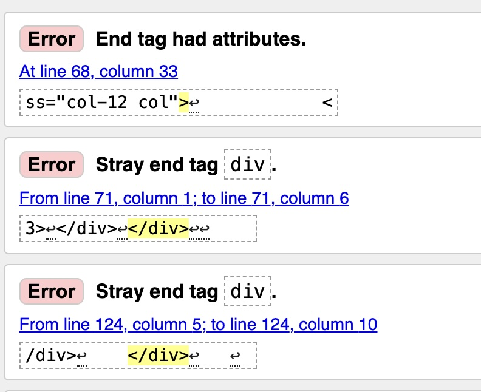

There were no errors on the Get in Touch page or the Thank you page.

The Data Policy page had some errors from an incorrectly written email link. I corrected this manually.

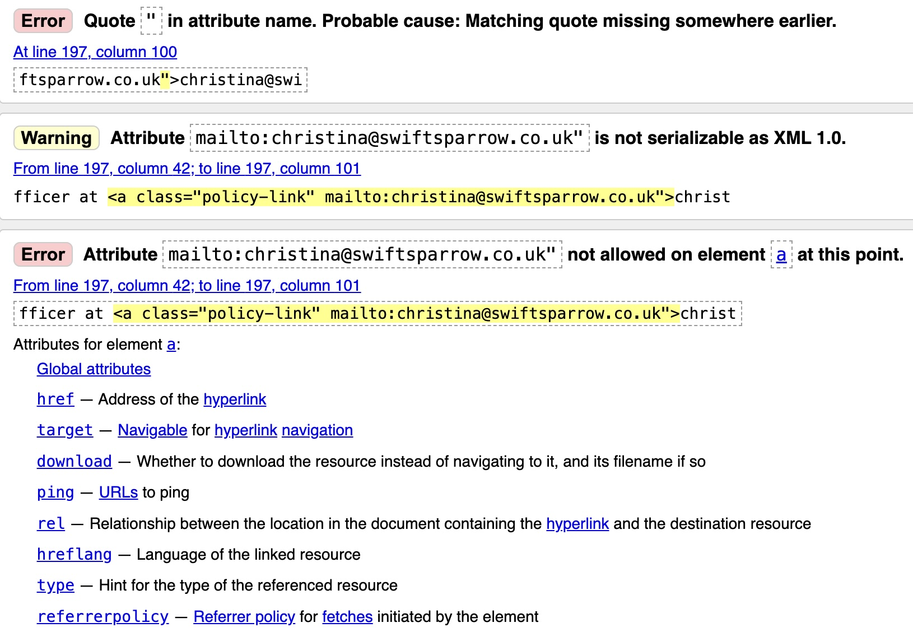

## 4. Credits

- Icons have been used from [Font Awesome](https://fontawesome.com/).
- [Google Fonts](https://fonts.google.com/) were used.
- The website uses a colour palette generated by [coloors.co](https://coolors.co/).
- I used lots of information from The Code Institute, including guidance from my mentor.

## 5. Image Credits

- Bird picture created by developer using [Canva](https://www.canva.com/).
- The chart image on the home page is from [Pixabay](https://pixabay.com/). The image is by [krzysztof-m](https://pixabay.com/users/krzysztof-m-1363864/).
- The graph image on the home page is from [Pixabay](https://pixabay.com/). The image is by [TheDigitalArtist](https://pixabay.com/users/thedigitalartist-202249/).
- The image used for the Data Analyst picture is from [Pixabay](https://pixabay.com/). The image is by [Pete Linforth](https://pixabay.com/users/thedigitalartist-202249/). 
- The image used for Data Architect picture is from [Pixabay](https://pixabay.com/). It is by [Jensen Art Co](https://pixabay.com/users/jensenartofficial-31380959/?utm_source=link-attribution&utm_medium=referral&utm_campaign=image&utm_content=7644533)
- The image used for the Pricing Analyst picture is from [Pixabay](https://pixabay.com/). The artist is [Wynn Pointaux](https://pixabay.com/users/wynpnt-868761/?utm_source=link-attribution&utm_medium=referral&utm_campaign=image&utm_content=2296821)
- The image used for the Data Engineer is from [Pixabay](https://pixabay.com/). The Artist is [Gerd Altmann]("https://pixabay.com/users/geralt-9301/?utm_source=link-attribution&utm_medium=referral&utm_campaign=image&utm_content=4904427)

## 6. Technologies Used

    - HTML 5 was used for the main body of the code.
    - CSS3 was used for the styling.
    - The website was developed using Visual Studio.
    - The website was hosted and deployed using Github.

## 7. Deployment

### 7.1 Version Control

The site was created using the Visual Studio code editor and pushed to github to the remote repository ‘Swiftsparrow-rec’.

The following git commands were used throughout development to push code to the remote repo:

```git add <file>``` - This command was used to add the file(s) to the staging area before they are committed.

```git commit -m “commit message”``` - This command was used to commit changes to the local repository queue ready for the final step.

```git push``` - This command was used to push all committed code to the remote repository on github.

### 7.2 Deployment to Github Pages

- The site was deployed to GitHub pages. The steps to deploy are as follows: 
  - In the GitHub repository, navigate to the Settings tab 
  - From the menu on left select 'Pages'
  - From the source section drop-down menu, select the Branch: main
  - Click 'Save'
  - A live link will be displayed in a green banner when published successfully. 

The live link can be found here - https://christinalicence.github.io/Swiftsparrow-rec/

### 7.3 Clone the Repository Code Locally

Navigate to the GitHub Repository you want to clone to use locally:

- Click on the code drop down button
- Click on HTTPS
- Copy the repository link to the clipboard
- Open your IDE of choice (git must be installed for the next steps)
- Type git clone copied-git-url into the IDE terminal

The project will now have been cloned on your local machine for use.